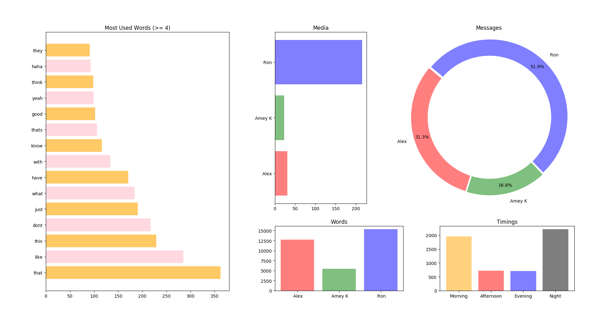

# Whatsapp-Visualizer

Vizualize statistics from your whatsapp chat.

### Requirements
- Python 3.*
- Whatsapp chat txt [export it from your app: More>Export chat>without media]

Save the .txt chat file in the same directory as all the .py files. I saved it as `chat.txt` for simplicity

#### Steps:
- clone the repo
    ```
    git clone https://github.com/ameyrk99/whatsapp-vis
    cd whatsapp-vis
    ```
- Save the file int the directory and execute
    ```
    python whatsappvis.py -f FILE -l WORDLENGTH -p PIE
    ```

#### Example:
```
python whatsappvis.py -f chat.txt -l 4 -p y
```

#### Expected Output:

_Clearly my friend "Ron" has no regard for storage smh._

#### Expected .csv output:
```
User,Messages,Words,Media
Alex,1735,12762,31
Amey K,929,5435,23
Ron,2874,15372,216
```
_.csv for you if you want to further use it_

### Note
- The result might be different for you if you have more than 4 users in your chat. The pie chart and vertical bar-graphs look very ugly if you have more than 4 users.

    use `-p y` if you want the pie chart anyway

    ___This is not required.___

- The `-l WORDLENGTH` is to get the minimum word length for the _Most Used Words_ graph. Default is 4. ___This is not required.___
