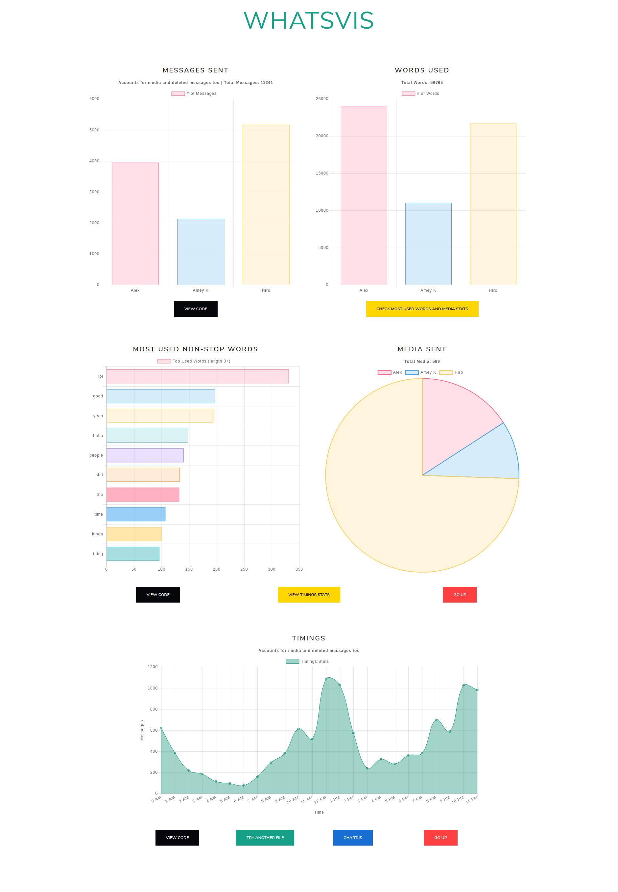

# Whatsapp-Visualizer

[Vizualize](https://ameyrk.me/whatsapp-visualizer/) statistics from your whatsapp chat.

### Uses:
- [chart.js](https://www.chartjs.org)
- [bootstrap](https://getbootstrap.com) (theme: [lux](https://bootswatch.com/lux/))

#### Expected Output:

### Note
- No data is collected.
- Everything over 12 users is displayed gray.
- Uses bar graph for messages and word stats for more than 6 users to keep graphs clean.