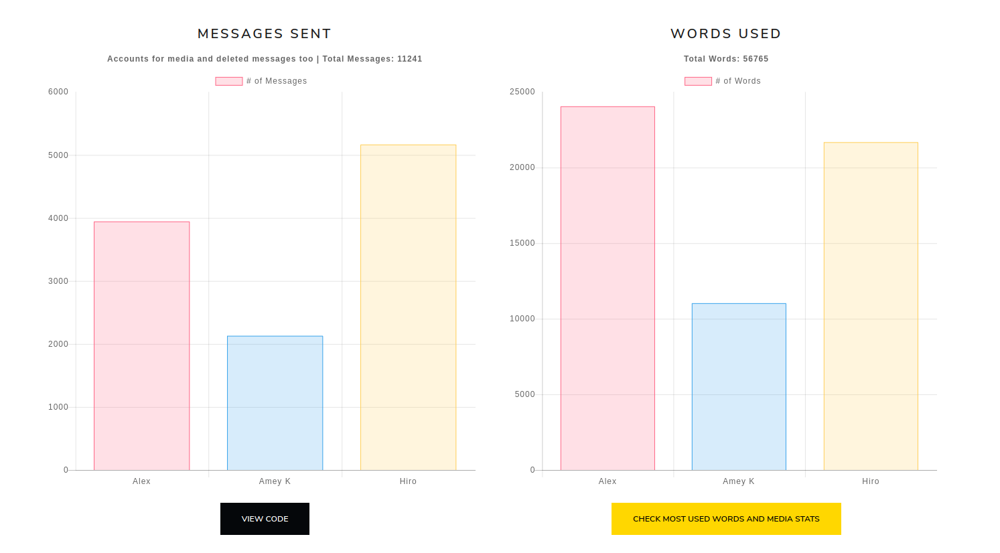
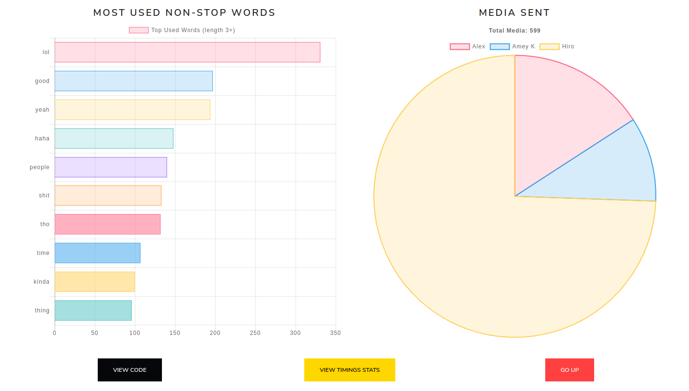

# Whatsapp-Visualizer

Vizualize statistics from your whatsapp chat.

### Uses:
- [chart.js](https://www.chartjs.org)
- [bootstrap](https://getbootstrap.com) (theme: [lux](https://bootswatch.com/lux/))

#### Expected Output:

---

_Clearly my friend "Hiro" has no regard for storage smh._

### Note
- No data is collected.
- Everything over 12 users is displayed gray.